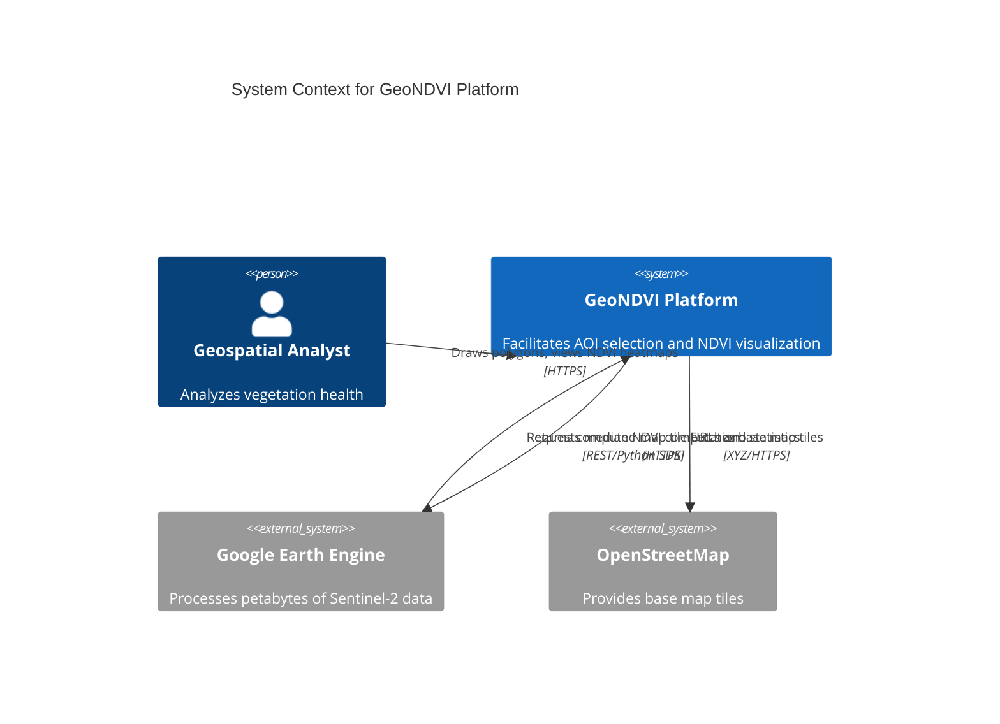

# GeoNDVI Architecture Specification

## 1. Executive Summary
GeoNDVI is a cloud-native geospatial platform engineered to monitor and analyze vegetation health at a planetary scale. It utilizes Google Earth Engine (GEE) as the core computational engine and Sentinel-2 multispectral imagery to calculate the Normalized Difference Vegetation Index (NDVI) dynamically. The architecture strictly follows modern microservices paradigms, segregating the client-side rendering from backend API facilitation and asynchronous Earth Engine data fetching.

This document serves as the authoritative architectural blueprint for the platform.

---

## 2. High-Level System Context
At a macro level, the system acts as a middleware orchestrator between a user's web browser and Google's Earth Engine infrastructure. 



---

## 3. Container and Subsystem Architecture

The platform is logically partitioned into isolated Docker containers that interact over an internal Docker bridge network.

### 3.1 The Frontend Container (React/Nginx)
The frontend container is responsible for serving the static Single Page Application (SPA). 
- **Build Stage**: A Node.js environment compiles the TypeScript/React code using Vite into static HTML, CSS, and JS assets.
- **Runtime Stage**: An Alpine-based Nginx server hosts these static assets.
- **Responsibilities**:
  1. Terminate client HTTP connections.
  2. Serve the UI to the user's browser.
  3. Reverse proxy all requests matching `/api/*` to the internal backend container. This completely eliminates CORS issues because the browser perceives the frontend and backend as residing on the same origin.

### 3.2 The Backend Container (FastAPI/Uvicorn)
The backend container is a stateless, asynchronous Python 3.10 microservice.
- **Web Server Interface**: Uvicorn acts as the ASGI server, translating HTTP requests from Nginx into Python asynchronous calls.
- **Framework**: FastAPI parses the requests, validates the GeoJSON payloads using Pydantic, and routes them to the appropriate Earth Engine service handlers.
- **Responsibilities**:
  1. Securely authenticate with Google Cloud IAM using injected Service Account credentials.
  2. Translate client-provided GeoJSON and date ranges into Earth Engine `ee.Geometry` and `ee.Filter` objects.
  3. Construct the Earth Engine Deferred Execution Graph (DAG).
  4. Materialize the data (via `.getInfo()`) and return the resulting statistics and tile URLs to the client.

---

## 4. Google Earth Engine Integration Mechanics

The most critical aspect of this architecture is its interaction with Google Earth Engine. GEE is not a traditional database; it is a distributed processing cluster.

### 4.1 Deferred Execution and DAG Construction
When the backend executes Python code (e.g., `image.normalizedDifference(['B8', 'B4'])`), the code does not execute on the FastAPI server. Instead, the Earth Engine Python SDK builds a JSON representation of a Directed Acyclic Graph (DAG). 
This graph represents the *intent* to calculate NDVI. No satellite imagery is downloaded to the local server, saving gigabytes of bandwidth and RAM.

### 4.2 Materialization
The DAG is only sent to Google's servers when the backend calls `.getInfo()` or `getMapId()`.
- `getMapId()`: Instructs GEE to render the calculated NDVI values into 256x256 pixel PNG tiles using a specified color palette. GEE returns a unique URL (e.g., `https://earthengine.googleapis.com/.../{z}/{x}/{y}`).
- `.getInfo()`: Instructs GEE to run a spatial reducer (`ee.Reducer.percentile`) over the computed NDVI image, collapsing millions of pixels into a single JSON dictionary containing the min, max, and mean values.

### 4.3 Data Pipeline: Sentinel-2 Harmonized
The specific dataset utilized is `COPERNICUS/S2_SR_HARMONIZED`. 
1. **Spatial Filtering**: The collection is filtered to only include scenes intersecting the user's AOI.
2. **Temporal Filtering**: The collection is filtered to the user's requested date window (e.g., ± 32 days).
3. **Cloud Masking**: A crucial step. The `QA60` bitmask band is interrogated. Any pixel where bit 10 (opaque clouds) or bit 11 (cirrus clouds) is set to 1 is aggressively masked out.
4. **Temporal Reduction**: The resulting stack of cloud-free pixels is reduced using `.median()`. If a specific coordinate was observed 4 times in the time window, the median of those 4 observations becomes the final pixel value. This guarantees a seamless, cloud-free composite image.

---

## 5. Security Architecture and Threat Modeling

Given the handling of cloud credentials and dynamic user inputs, security is enforced at multiple layers.

### 5.1 Credential Management
- **The Anti-Pattern**: Baking the Google Service Account `key.json` into the Docker image is strictly prohibited.
- **The Implementation**: The `key.json` is mounted as a read-only Docker Volume at runtime. In production environments (e.g., Kubernetes), this volume is populated securely via Kubernetes Secrets or GCP Secret Manager.
- **IAM Scoping**: The Service Account is granted the absolute minimum IAM roles required (e.g., `Earth Engine Resource Viewer`). It has no administrative access to GCP resources.

### 5.2 Input Validation and DoS Prevention
A malicious actor could theoretically submit an incredibly complex GeoJSON polygon (e.g., tracing the entire coastline of Norway with millions of vertices) or a massive bounding box covering the entire Earth. This would trigger a massive Earth Engine computation, exhausting the project's quota or causing a Denial of Service.
- **Pydantic Strictness**: The API validates that the input is exactly a valid GeoJSON Polygon.
- **Area Mitigation**: Before constructing the GEE graph, the backend calculates the physical area of the polygon (`ee.Geometry.area()`). If this exceeds `MAX_AREA_KM2` (configured via `.env`), the API instantly terminates the request with HTTP 400 Bad Request.
- **Nginx Limits**: Nginx enforces a strict 50MB `client_max_body_size` limit to drop massive malicious payloads before they ever consume Python memory.

---

## 6. Frontend Architecture Deep Dive

The React frontend relies on a unidirectional data flow and strict component separation.

### 6.1 Component Hierarchy
- `App.tsx`: The orchestrator. It holds the global state (selected date, search window, AOI geojson, and API response data).
- `Sidebar.tsx`: The control panel. It dispatches state updates back to `App.tsx` and triggers the main API fetch command.
- `MapView.tsx`: The visualization layer. It is a highly optimized wrapper around the Leaflet engine.

### 6.2 Geospatial Rendering (Leaflet)
Leaflet operates outside the React DOM lifecycle. To prevent React from destroying and recreating the map on every state change, the Leaflet instance is stored in a `useRef`. 
When the backend returns a new GEE tile URL, a `useEffect` hook intercepts this change, removes the old tile layer from the map reference, and injects the new one. 
This provides a buttery-smooth user experience without page reloads.

### 6.3 Draw Control Fixes
The `leaflet-draw` plugin is utilized for polygon creation. However, standard implementations of Leaflet Draw conflict with modern Mac Trackpad gestures, often resulting in erratic map panning while attempting to draw. The architecture mitigates this by manually hooking into the `draw:drawstart` and `draw:drawstop` events to dynamically disable and re-enable map dragging capabilities during the drawing phase.

---

## 7. Deployment and CI/CD

The platform is designed to be deployed to a Kubernetes cluster (e.g., GKE) using Helm or Kustomize.

### 7.1 Scalability Profile
Because the FastAPI backend is completely stateless—storing no session data, no caching, and relying entirely on GEE for computation—it can scale horizontally to infinity.
- If request volume spikes, Kubernetes Horizontal Pod Autoscalers (HPA) can spawn additional backend replicas.
- The frontend static assets can be offloaded entirely to a CDN (e.g., Cloudflare), reducing the load on the cluster to purely API routing.

### 7.2 Docker Build Optimization
The frontend `Dockerfile` implements a multi-stage build:
1. `node:18-alpine` pulls the dependencies and compiles the Vite project.
2. `nginx:alpine` copies only the compiled `dist` folder.
This reduces the final container image size from >1GB (due to `node_modules`) to under 30MB, drastically accelerating CI/CD pipeline deployments and minimizing the attack surface.

---

## 8. API Contract Definition

To facilitate frontend-backend decoupling, a strict JSON contract is enforced.

### 8.1 Request Payload
`POST /api/ndvi`
```json
{
  "geometry": {
    "type": "Polygon",
    "coordinates": [[[lon, lat], [lon, lat], ...]]
  },
  "date": "2026-09-15",
  "satellite": "Sentinel-2",
  "window_days": 32
}
```

### 8.2 Response Payload
`HTTP 200 OK`
```json
{
  "tile_url": "https://earthengine.googleapis.com/v1alpha/...",
  "stats": {
    "min": 0.12,
    "max": 0.89,
    "mean": 0.54
  },
  "vis": {
    "min": 0.0,
    "max": 1.0,
    "palette": ["#ff0000", "#ffff00", "#00ff00"]
  },
  "scene_count": 14,
  "area_km2": 45.2
}
```

---

## 9. Future Architectural Enhancements

As the platform matures, several architectural expansions are planned:

1. **Redis Result Caching**: Currently, every request queries Earth Engine. By implementing Redis, the backend can hash the requested GeoJSON geometry and date parameters. If a cache hit occurs, the backend can instantly return the previously generated tile URL and statistics, bypassing GEE entirely and saving significant API quota.
2. **PostgreSQL/PostGIS Integration**: To allow users to save their drawn polygons and historical NDVI statistics, a relational database with spatial extensions will be introduced. 
3. **Celery Asynchronous Workers**: For calculations over massive areas (e.g., an entire country), GEE `.getInfo()` calls may exceed the standard 30-second HTTP timeout. Implementing a Celery worker queue will allow the backend to return a Task ID immediately, while the frontend polls for completion via WebSockets.